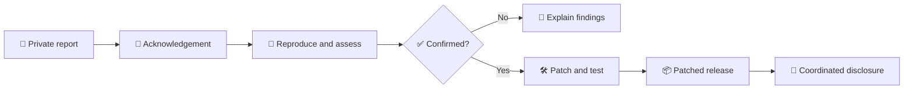

# 🔐 Security Policy — `agentic-architectures`

> **Responsible disclosure:** Please report suspected vulnerabilities privately so users and maintainers can respond safely.

## 🧭 Supported versions

Only the latest minor release in the `0.3.x` line currently receives security updates.

| Version | Security support |
|---|---|
| `0.3.x` (current supported line) | ✅ Supported |
| `< 0.3` | ❌ Unsupported |

### Version policy

Security fixes are developed against the latest supported minor release. Users on older releases should upgrade before requesting a backport. Backports may be considered when impact and maintenance cost justify them.

> **Verified:** The repository package metadata currently declares `agentic-architectures` version `0.3.0` in `pyproject.toml`.

## 🚨 Reporting a vulnerability

**Please do not open a public GitHub issue for a suspected security vulnerability.**

Send a private report to **[saskw2010@gmail.com](mailto:saskw2010@gmail.com)** with:

- A concise description and security impact
- Affected component(s), version(s), and deployment mode
- Clear reproduction steps or a minimal proof of concept
- Preconditions, required permissions, and attacker capabilities
- Expected behavior versus observed behavior
- Sanitized logs, traces, screenshots, or request/response samples
- Your name and GitHub handle, if you would like public credit

Remove or redact credentials, personal data, customer information, proprietary prompts, and production vector-store contents before sending a report.

### Suggested report template

```text
Subject: [SECURITY] <short vulnerability title>

Project/version:
Affected component:
Severity estimate:
Attacker prerequisites:

Summary:
Impact:
Steps to reproduce:
Proof of concept:
Expected result:
Observed result:
Suggested remediation:

Reporter name:
GitHub handle:
Safe contact method:
```

## 🛡️ In scope

The following are security issues when they permit unauthorized action, data access, policy bypass, or secret exposure:

- **Prompt-injection bypasses of safety gates**, especially in `BrowserAgent`, `ComputerUse`, `DryRun`, `SWEAgent`, or `ConstitutionalAI`.
- **Deterministic-picker safety failures** that approve an action that should have been denied, blocked, or escalated for human approval.
- **Sandbox escapes**, including:
  - `SWEAgent._safe_path()` accepting `../` traversal or equivalent path confusion
  - `BrowserAgent._check_safety()` allowing blocked or untrusted domains
  - `Voyager` subprocess isolation failures
- **Secret leakage**, including accidental logging, persistence, transmission, or exposure of API keys, credentials, private prompts, embeddings, or vector-store contents.
- **Authentication, authorization, tenant-isolation, or approval-bypass flaws** that expose data or enable unauthorized operations.
- **Dependency vulnerabilities** in pinned dependencies where a known CVE or equivalent issue remains unaddressed in a supported release.

## 🚫 Out of scope

- LLM-output quality problems such as hallucinations, weak reasoning, or incorrect routing without a security impact. Report these as bugs.
- Vulnerabilities that exist solely in an upstream dependency. Report them upstream first and notify this project when it materially affects `agentic-architectures`.
- Issues requiring compromised administrator credentials or unrestricted local code execution unless they demonstrate an additional security-boundary bypass.
- Rate-limit or availability complaints without a meaningful security consequence.

## 📊 Severity and triage

| Level | Typical impact | Target response |
|---|---|---|
| 🔴 Critical | Remote code execution, cross-tenant secret/data exposure, or safety-gate bypass enabling high-impact action | Immediate triage |
| 🟠 High | Authentication/authorization bypass, sandbox escape, or reliable credential leakage | Priority triage |
| 🟡 Medium | Limited data exposure, scoped policy bypass, or exploitable unsafe behavior with meaningful prerequisites | Standard triage |
| 🟢 Low | Defense-in-depth weakness with no demonstrated security impact | Best-effort review |

These targets are operational goals, not a guarantee of a specific resolution date.

## 🔄 Disclosure and response process



- We aim to acknowledge reports within **3 business days**.
- A patched release is typically published within **14 days after confirmation**, depending on severity, complexity, and release risk.
- We follow a standard **90-day coordinated disclosure** window.
- If a reporter needs more time, contact us before disclosure so we can coordinate.
- If more time is needed to patch, we will explain why and propose an updated date.

## 🧰 Safe testing expectations

Only test systems and data you own or are explicitly authorized to assess. Keep proof-of-concept activity minimal, avoid destructive actions, and stop once the security impact is demonstrated. Never exfiltrate real secrets or customer data to prove a finding.

## 🏅 Researcher credit

With the reporter's permission, we may credit valid disclosures in release notes or a security advisory. Do not publish sensitive details until the coordinated disclosure window has ended.

## 📌 Maintainer checklist

- [ ] Confirm the affected version is within the supported `0.3.x` line.
- [ ] Reproduce in an isolated environment using sanitized data.
- [ ] Determine impact, exploitability, and affected trust boundaries.
- [ ] Rotate exposed credentials immediately.
- [ ] Add a regression test before merging the fix.
- [ ] Review logs, traces, prompts, and dependency changes for secondary leakage.
- [ ] Publish a patched release and advisory when appropriate.

---

**Last reviewed:** 2026-07-14  
**Policy owner:** `agentic-architectures` maintainers
