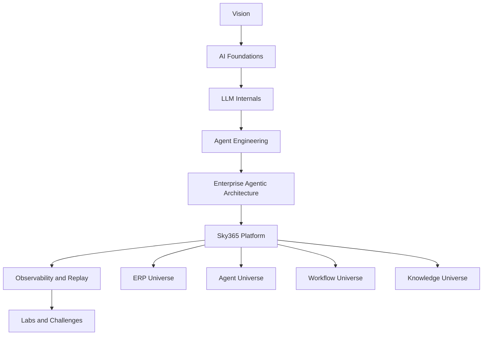
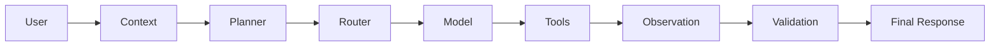

# White Sky Universe

> **Vision · Architecture · Execution · Sovereignty**
>
> A visual, interactive academy that explains how modern AI systems work — from a character entering a tokenizer to enterprise multi-agent execution inside Sky365.

## Why this belongs in the academy

The current academy is strong at cataloguing runnable agentic patterns. White Sky Universe adds the missing learning journey around those patterns: foundations, visual explanations, enterprise context, engineering challenges, and a bridge from theory to the real Sky365 platform.

This section is a **documented product and curriculum plan**. It does not claim that every lesson, animation, or lab already exists.

## Experience principles

1. **Visual first** — every major concept begins with a diagram, animation, or interactive scene.
2. **Evidence over decoration** — motion must explain execution, data flow, or system behavior.
3. **Theory to production** — each concept connects to a real architecture, implementation pattern, or Sky365 capability.
4. **Challenge after explanation** — every lesson ends with a question, lab, design task, or debugging scenario.
5. **Progressive depth** — Beginner → Intermediate → Advanced → Architect → CTO.
6. **Check first, then build** — inspect the repository and existing documentation before adding new material.

## Universe map



## Entry experience: Sky365 Motion Identity

The academy opens with a simple animated system mark:

```text
                 WytSky Logo

                    VISION

                       ○
                    SKY365
             ╱       │ │ │       ╲
          Sales   Finance   HR     ERP
          CRM        AI    Docs  Workflow
                        Analytics

       Vision • Architecture • Execution • Sovereignty

                    Mosso Nigro
```

### Motion sequence

1. WytSky identity fades in.
2. VISION appears.
3. SKY365 forms at the center.
4. Agent and business nodes appear progressively.
5. A pulse travels from node to node.
6. The entire network becomes active.
7. The footer statement and signature appear.
8. The loop restarts smoothly.

The first version may be a GIF or MP4 for documentation. The preferred in-product implementation is interactive SVG/Canvas so the same visual can later display real traces.

## Curriculum

### Level 0 — Vision

- WytSky vision and operating principles
- Why Sky365 exists
- Vision, architecture, execution, and sovereignty
- AI as a platform capability, not a chatbot feature
- White Sky Universe map

**Challenge:** Explain the difference between an AI feature, an AI product, and an AI operating platform.

### Level 1 — AI Foundations

- Data, models, training, inference
- Parameters, weights, activations, and layers
- Neurons as mathematical units, not biological replicas
- What a model learns and what it does not store literally
- Deterministic software versus probabilistic model behavior

**Visual scene:** input value → weight → bias → activation → output.

**Challenge:** Identify which parts of a neural network are learned and which parts are fixed by architecture.

### Level 2 — Tokenization

The learning path follows a query from raw text into model-ready IDs.

```text
Characters
   ↓
Tokenizer
   ↓
Tokens / Subwords / Bytes
   ↓
Token IDs
```

Topics:

- Character-level tokenization
- Word-level tokenization
- Subword tokenization
- Byte-level tokenization
- BPE
- WordPiece
- Unigram models
- SentencePiece as a tokenizer framework
- Vocabulary size, unknown tokens, and multilingual trade-offs

**Important distinction:** SentencePiece is not “sentence tokenization.” It is a tokenizer framework that commonly implements subword algorithms such as BPE or Unigram directly over raw text.

**Challenge:** Compare how Arabic, English, code, and mixed-language text may fragment under different tokenizers.

### Level 3 — Embeddings

```text
Token ID
   ↓
Embedding lookup table
   ↓
Dense vector
   ↓
Contextual processing
```

Topics:

- Token embeddings
- Position information
- Static lookup vectors versus contextual representations
- Dimensions and embedding matrices
- Similarity, distance, and semantic neighborhoods
- Why an embedding is not a hash
- Multilingual embedding challenges
- Retrieval embeddings versus internal LLM hidden states

**Challenge:** Diagnose a multilingual retrieval failure caused by poor chunking, model mismatch, or similarity thresholds.

### Level 4 — Transformer Internals

- Query, Key, and Value projections
- Self-attention
- Multi-head attention
- Feed-forward layers
- Residual connections
- Layer normalization
- Context windows
- Causal masking
- Next-token prediction
- Sampling and decoding

**Visual scene:** a pulse travels through embedding → attention → feed-forward → logits → selected token.

**Challenge:** Explain why attention is not memory and why a larger context window does not automatically guarantee better reasoning.

### Level 5 — Agent Engineering

- Agent loop
- ReAct
- Planning and decomposition
- Reflection and verification
- Tool use
- Memory patterns
- Routing
- Guardrails
- Human approval
- Single-agent versus multi-agent systems



**Challenge:** Decide whether a use case needs one agent, multiple specialists, or a deterministic workflow with limited LLM assistance.

### Level 6 — Enterprise Agentic Architecture

- API gateway and security
- Identity, authorization, and tenant isolation
- Agent runtime and orchestration
- Model selection and provider abstraction
- Semantic and knowledge layers
- Business capability layer
- Policy, workflow, and approval engines
- Tool execution
- Observability, cost, evaluation, and replay
- Infrastructure and resilience

**Challenge:** Audit a repository and classify it as LLM Wrapper, Agentic Prototype, Single-Agent MVP, Multi-Agent Platform, or Production-Grade Agentic Architecture.

### Level 7 — ERP Universe

Business domains are taught as interconnected capability systems rather than isolated screens.

- Finance
- Sales
- Inventory
- Purchasing
- CRM
- HR
- Projects
- Documents
- Workflow
- Approvals
- Analytics
- Cost centers
- Multi-tenant administration

Each domain should include:

- Business purpose
- Core entities
- Key transactions
- Controls and approvals
- Events and integration points
- Agent use cases
- Risks and audit requirements

**Challenge:** Trace a supplier approval or overdue invoice scenario across Sales, Finance, Workflow, Approval, Notifications, and Audit.

### Level 8 — Sky365 Agentic Flow

The academy connects theory to the actual Sky365 execution path.

```text
User Request
   ↓
Context and Intent
   ↓
Policy and Risk
   ↓
Route and Plan
   ↓
Model and Tools
   ↓
Shared Action Core
   ↓
Validation and Approval
   ↓
ERP / Workflow execution
   ↓
Trace and Final Response
```

The documented Flight Recorder stages are:

`Raw → Context → Intent → Entities → Policy → Risk → Route → Plan → Draft → Validation → Approval → Final`

Every stage must be marked as Working, Partial, Placeholder, Designed, Not Found, or Unknown based on evidence from the current code and runtime.

**Challenge:** Replay a request and identify where a wrong decision entered the chain.

### Level 9 — Observatory and Live Replay

- Trace IDs and correlation
- Step-level execution
- Model and provider selection
- Tool calls
- SQL and external API actions
- Policies and approvals
- Latency, tokens, and cost
- Errors, retries, and fallbacks
- Live visual pulse through architecture nodes
- Historical trace replay

**Challenge:** Use a trace to determine whether failure came from retrieval, planning, model routing, policy, authorization, tool execution, or validation.

### Level 10 — Labs, Challenges, and Certification

Every topic supports five depths:

| Level | Outcome |
|---|---|
| Beginner | Explain the concept accurately |
| Intermediate | Configure or use it correctly |
| Advanced | Implement and debug it |
| Architect | Design it with trade-offs |
| CTO | Govern, fund, scale, and measure it |

Planned lab families:

- Tokenizer playground
- Embedding space explorer
- Attention visualizer
- Prompt and context debugging
- RAG quality lab
- Agent loop simulator
- Multi-agent coordination lab
- Model router lab
- Policy and approval lab
- Repository architecture auditor
- Sky365 trace replay lab

## Visual production backlog

### Motion assets

- Sky365 Motion Identity
- Character-to-token animation
- Token-to-embedding animation
- Attention pulse animation
- Next-token prediction animation
- ReAct loop animation
- Multi-agent handoff animation
- ERP transaction journey
- Policy and approval journey
- Live trace replay

### Static infographics

- White Sky Universe map
- LLM anatomy
- Tokenizer families
- Embedding concepts and failure modes
- Agent architecture maturity model
- Enterprise agentic reference architecture
- Sky365 business capability map
- Sky365 Flight Recorder
- Model selection and routing
- Observability and governance

### Interactive pages

- White Sky Universe home
- LLM Journey
- Agent Architecture Explorer
- ERP Universe
- Agentic Architecture Audit
- Model Router Viewer
- Trace Replay
- Challenge Arena

## Content contract for every lesson

Each lesson should contain:

1. One-sentence concept definition
2. Why it matters
3. Visual or animation
4. Technical explanation
5. Real example
6. Common misconception
7. Failure mode
8. Connection to agentic architecture
9. Connection to Sky365 when relevant
10. Challenge or lab
11. Evidence and references
12. Completion criteria

## Architecture audit integration

The academy should include an **Agentic Architecture Maturity & Compliance Tool** that can inspect a repository and produce:

- Capability checklist
- Evidence references
- Maturity score
- Multi-agent score
- Security and governance gaps
- Production-readiness assessment
- Claims not proven
- Missing evidence
- Recommended next actions

No criterion is considered complete because a class, table, or UI page has the right name. A result requires evidence from an executable code path, runtime behavior, test, database trace, or verified configuration.

## Delivery phases

### Phase 1 — Document and organize

- Confirm the correct academy repository and ownership model
- Add this White Sky Universe plan to navigation
- Inventory existing academy content
- Avoid duplicating current lessons and diagrams
- Define brand asset locations and naming conventions

### Phase 2 — Visual foundation

- Add Sky365 Motion Identity
- Build the White Sky Universe static map
- Establish reusable node, edge, pulse, agent, model, tool, database, policy, and workflow components
- Define export formats: SVG, PNG, GIF, MP4, and interactive HTML

### Phase 3 — LLM learning journey

- Tokenization
- Embeddings
- Attention
- Transformer blocks
- Inference and next-token prediction
- Challenges and misconception checks

### Phase 4 — Agent engineering journey

- Agent loops
- Planning
- Tools
- Memory
- Routing
- Guardrails
- Multi-agent patterns

### Phase 5 — Enterprise and Sky365 journey

- Enterprise agentic reference architecture
- ERP Universe
- Sky365 architecture map
- Flight Recorder
- Agent Observatory
- Live Trace Replay

### Phase 6 — Academy productization

- Learning paths
- Progress tracking
- Labs
- Assessments
- Certification
- Public and private content boundaries
- Contributor and review workflow

## Governance and intellectual-property note

This repository currently identifies itself as the work of its upstream author in site metadata and links. Before White Sky Universe becomes a branded WytSky academy, confirm the intended fork/derivative strategy, preserve upstream attribution and license terms, and separate original WytSky content clearly from upstream material.

## Definition of success

White Sky Universe succeeds when a learner can:

- understand how text becomes model input;
- explain the essential internals of an LLM without misleading metaphors;
- distinguish workflows, agents, and multi-agent systems;
- inspect an enterprise agentic architecture;
- understand how ERP capabilities interact;
- follow a Sky365 request from user input to traceable outcome;
- complete practical challenges at an appropriate depth;
- use the academy as both a learning environment and a production engineering reference.
